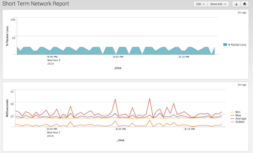
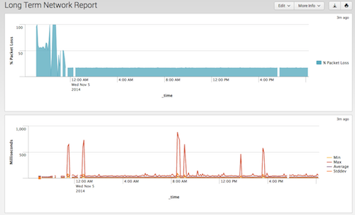

# Splunk Network Monitor

A Splunk app to monitor your Internet connection

**tl;dr** Keep track of your Internet connection and get pretty graphs like these:

 

## What's Splunk?

Splunk is an amazing app that lets you monitor your logfiles and perform analytics on them.  You can monitor other kinds of data, such as the output of the ping command, which is what this app does.  A free copy of Splunk Enterprise [can be downloaded at Splunk.com](http://www.splunk.com/)

## Installation

This assumes you are running this on a machine with Vagrant and Virtual box installed.  If you are running this on a machine 
that has already been created, simply remove the references to Vagrant.

- Download this app:
	- `git clone git@github.com:dmuth/splunk-network-monitor.git`
- Start Vagrant with `vagrant up`
- SSH into the Vagrant instance with `vagrant ssh`
- Install Splunk with `sudo /vagrant/bin/install_splunk.sh`
    - Agree to the license and then watch Spkunk start
    - Not that you'll need a Splunk .deb file named `splunk.deb` in the current directory
- Deploy this app:
	- `sudo /vagrant/bin/deploy_symlink.sh $SPLUNK_ROOT` if you'd like to have a symlink pointing to this directory
	- `sudo /vagrant/bin/deploy.sh $SPLUNK_ROOT` if you'd like to have this directory copied into $SPLUNK_HOME/Network-Monitor/
- Restart Splunk:
    - `sudo $SPLUNK_HOME/bin/splunk restart`
- Log into Splunk on [http://localhost:8000/](http://localhost:8000/) and click "App: Network Monitor" to see your connectivity reports.

## Usage

While in Splunk, click "App" and then "Network Monitor".

There will be a menu across the top that lets you run reports.

## How does it work?

At its core, this app uses not one, but **two** scripts to run ping.  The first script (ping.sh) pings google.com for 10 seconds at a time and then returns the results.  The second script (ping-long.sh) pings google.com for 5 minutes at a time and then returns the results.  

The reason for these two separate scripts is because the first script is useful seeing what short-term behavior of your Internet connection is, but there can be a pause of as much as 1 second between invocations of the script.  ping-long.sh mitigates that by running for a much longer interval and can be used to see how your connection performed over a longer period of time.

### Why ping google.com?

Google's website is ridiculuously multi-homed, and as such has excellent availability.

In the future I'll look into adding a configuration page so that the host to ping can be specified.  (This is my first Splunk app, so one thing at a time :-)  )

## Compatibility

This has been written for (and tested on) Splunk 6.2

Splunk 6.2, in turn, has been tested on Ubuntu 14.04 LTS and Macintosh OS/X 10.8.5.  **If you would like to run this in Windows**, your best bet is just to set up Ubuntu 14.04 LTS in a VM.  256 Megs of RAM should be sufficient.

## TODO

Things I might implement in the future:
- Put the output of ping into a separate index (currently in main)
- App configuration for which host to ping
- Support for multiple hosts (border routers, etc.)
- Traceroute functionality that pings each host on the way (perhaps by using mtr?)
- Dropdown list on the dashboards to select the time interval

    
## Questions, comments, abuse, and offers of employment

Hit me up via [email](mailto:dmuth@dmuth.org), or [Facebook](http://www.facebook.com/dmuth).
