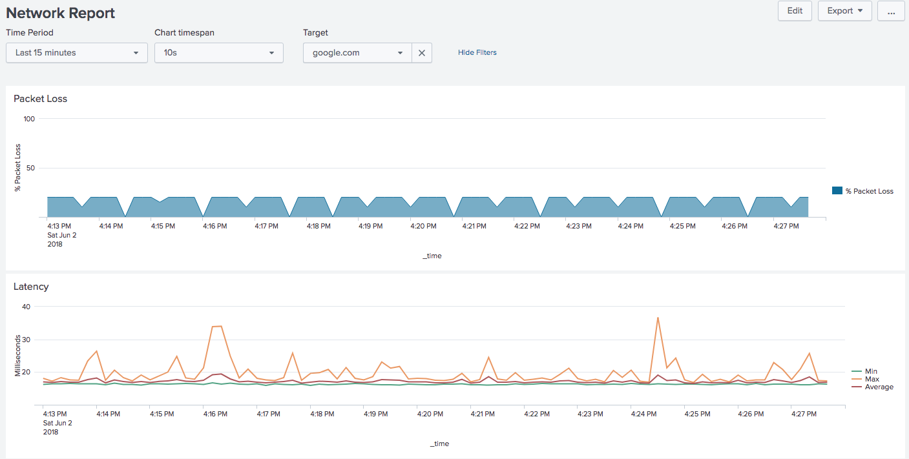

# Splunk Network Monitor

This app will monitor your Internet connection by pinging Google and creating nice graphs.

60 second installation:

```
docker run --name splunk --restart unless-stopped -d --rm -p 8000:8000 \
	-v $(pwd)/data:/opt/splunk/var/lib/splunk/defaultdb \
	dmuth1/splunk-network-monitor
docker logs -f splunk
```

You can now go to http://localhost:8000/ and get graphs like these:


 


Data will be persisted in the `data/` directory between container runs.

### Default Targets

These are the default targets, but can be overridden with `-e TARGETS=...`: 

- google.com
- 8.8.8.8 (Google's DNS Resolver)
- 1.1.1.1 (CloudFlare's DNS Resolver)

I picked Google because it's a fairly well connceted site, and I picked the second two IPs so that if 
DNS is flaky, it won't impact either those, and those two IP addresses are owned by completely different entities.


## More detailed options

- Want to specific specific hosts to ping? `-e "TARGETS=google.com cnn.com 8.8.8.8 1.1.1.1"` is the way to do that
- Want to get an interactive shell? Before sure to specific `-e INTERACTIVE=1 -ti` in the `docker run` command
- Want to get your local timezone? Use something similar to `-e TZ=EST5EDT` in the `docker run` command.
- Want to set a non-default password? Use `-e SPLUNK_PASSWORD=password` to do that.
   - Note that passwords in Splunk must be at least 8 characters long.


## What's Splunk?

Splunk is an amazing app that lets you monitor your logfiles and perform analytics on them.  You can monitor other kinds of data, such as the output of the ping command, which is what this app does.  A free copy of Splunk Enterprise [can be downloaded at Splunk.com](http://www.splunk.com/)


## How does it work?

At its core, this app uses not one, but **two** scripts to run ping.  The first script (`ping.sh`) pings google.com for 10 seconds at a time and then returns the results.  The second script (`ping-long.sh`) pings google.com for 5 minutes at a time and then returns the results.  

The reason for these two separate scripts is because the first script is useful seeing what short-term behavior of your Internet connection is, but there can be a pause of as much as 1 second between invocations of the script.  `ping-long.sh` mitigates that by running for a much longer interval and can be used to see how your connection performed over a longer period of time.


## Security Concerns

**Please** set a password if you are deploying this on anything other than a personal device.
That is done with `-e SPLUNK_PASSWORD=<password>`.


## Development

Here's how to do development:

```
docker build . -t splunk && \
	docker run --rm --name splunk \
	-e INTERACTIVE=1 -e TZ=EST5EDT -ti -p 8000:8000 \
	-v $(pwd)/data:/opt/splunk/var/lib/splunk/defaultdb \
	-v $(pwd):/mnt
	--privileged
	splunk
docker tag splunk dmuth1/splunk-network-monitor
docker push dmuth1/splunk-network-monitor
```

`--privileged` is specified so that `/opt/splunk/etc/apps/Network-Monitor/bin/icmp_loop.sh` can
be run inside of the container for testing.


## Questions, comments, abuse, and offers of employment

- Email: doug.muth@gmail.com
- Twitter: http://twitter.com/dmuth
- Facebook: http://facebook.com/dmuth


