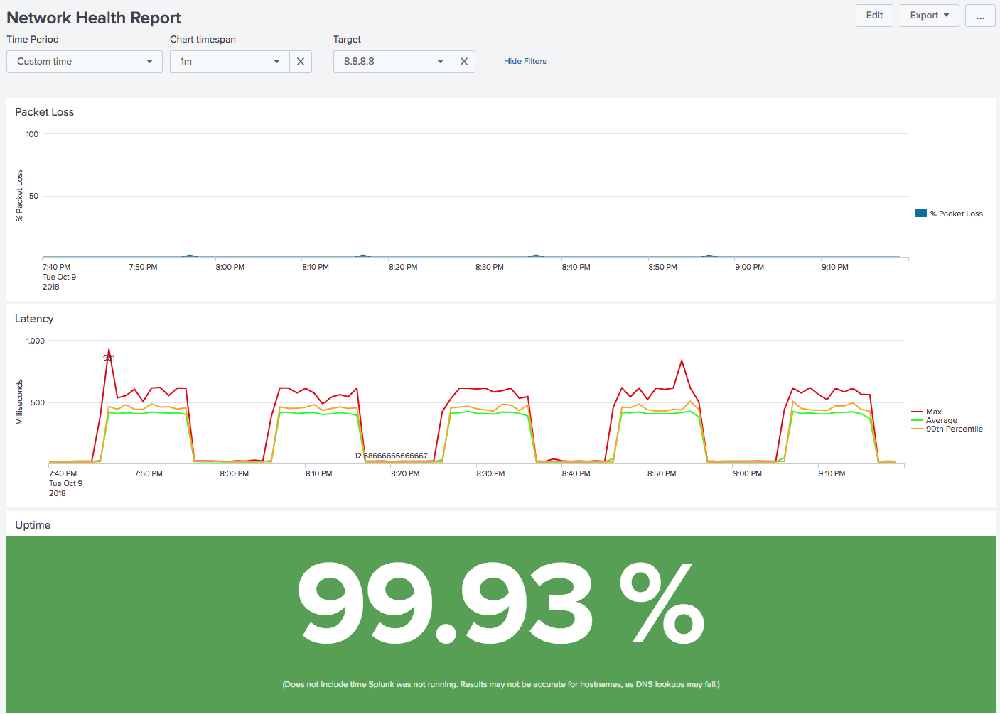

# Splunk Network Health Check

This app will monitor health of your Internet connection by pinging Google 
(and a few other hosts) and creating nice graphs.  It is based on
<a href="https://hub.docker.com/r/splunk/splunk/">Splunk's official Dockerfile</a>.

This app uses <a href="https://github.com/dmuth/splunk-lab">Splunk Lab</a>, an open-source 
app I built to effortlessly run Splunk in a Docker container.


## Quickest Installation

`bash <(curl -s https://raw.githubusercontent.com/dmuth/splunk-network-health-check/master/go.sh)`

Follow the on-screen instructions for configuration Splunk Network Health Check 
and you should be running in no time!


## Less Quick Installation

Maybe you don't want to pipe some random script on the Internet into your shell, that's cool.
Here are the Docker commands to run it and view the output:

```
docker run --name splunk-network-health-check -d --rm -p 8000:8000 \
	-v $(pwd)/splunk-data:/opt/splunk/var/lib/splunk/defaultdb \
	dmuth1/splunk-network-health-check
docker logs -f splunk-network-health-check
```


No matter how you install it, you can then go to http://localhost:8000/ and get graphs like these:

  


Data will be persisted in the `splunk-data/` directory between container runs.


### Default Targets

These are the default targets, but can be overridden with `-e TARGETS=...`: 

- google.com
- 8.8.8.8 (Google's DNS Resolver)
- 1.1.1.1 (CloudFlare's DNS Resolver)

I picked Google because it's a fairly well connceted site, and I picked the second two IPs so that if 
DNS is flaky, it won't impact either those, and those two IP addresses are owned by completely different entities.


## More detailed options

- `--restart unless-stopped` - Causes this container to restart if killed Docker is restarted. **This is highly recommended.**
- `-e "TARGETS=google.com,cnn.com,8.8.8.8,1.1.1.1"` - Specify hosts to ping
- `-e ETC_HOSTS=hosts.txt` - Specify a hosts file to append to `/etc/hosts`.  Useful for when you want to give names to local devices to ping, such as cameras.
- `-e SPLUNK_PASSWORD=password` - Set a non-default password. You WILL do this if you run this in a production environment.


## What's Splunk?

Splunk is an amazing app that lets you monitor your logfiles and perform analytics on them.  You can monitor other kinds of data, such as the output of the ping command, which is what this app does.  A free copy of Splunk Enterprise [can be downloaded at Splunk.com](http://www.splunk.com/) and is downloaded in the Dockerfile.


## How does it work?

At its core, this app uses a script called `ping.sh`.  This script runs <a href="https://github.com/dmuth/iputils">a hacked version of ping</a> to ping all targets and report on status (packets sent/packets received) every 10 seconds.


### "Oh god, why did you hack ping?"

A few reasons:

- `fping` sometimes returned negative RTTs, so that's not a good sign.
- Running `ping -c 10` multiple times in parallel caused N processes to be spawned every 10 seconds. 
   - The performance impact wasn't *terrible*, but I wanted this app to be as friendly to the CPU as I could make it.
- `fping` also didn't periodically report on the status of hosts that I was pinging.
- `fping` also got a little weird if there was no Internet connectivity, as DNS would not resolve
   - You'd think this *wouldn't* be a problem when pinging IPs, but sadly, it was.

Taking all of these into account, it seemed to make the most sense to hack ping to print its status every 10
seconds and use that as the basis of the uptime graph in Splunk.


## Security Concerns

**Please** set a password if you are deploying this on anything other than a personal device.
That is done with `-e SPLUNK_PASSWORD=<password>`.


## Development


### The Easy Way

There are some helper scripts in `bin/` which make the process less painful:

- `bin/dev.sh - Build an image from the Dockerfile, start it, and spawn a `bash` shell
   - This is actually a wrapper for `go.sh`, so just follow the on-screen prompts.
   - When exited, the container will end.
- `bin/kill.sh` - Stop the container and kill it.
- `bin/logs.sh` - Tail the logs of the currently running container
- `bin/clean.sh` - Remove `splunk-data/` directory.  This will remove all indexed data (pings and latency) from Splunk!
- `bin/push.sh` - Push the image up to Docker Hub


## Known Bugs

For reasons unclear to me, if you set up a VPN connection, this completely breaks ping in all
Docker containers.  Even `docker run alpine ping google.com` doesn't work.

The workaround is to simply restart Docker.  If you started your container with `--restart unless-stopped`,
it will start up automatically.  I am unclear on if this is something that can be fixed.


## FAQ

### Why does the Splunk web interface run with HTTPS enabled?

Because one day, someone somewhere will install this app on a machine which faces
the public Internet, and passwords will be sent over the clear.  In fact, over a 
long enough time, the odds of this happening approach 1.

THAT is why I use HTTPS/SSL.  And why you should too on your apps.


### How do I get this to work in Vagrant?

If you're running <a href="https://github.com/dmuth/docker-in-vagrant">Docker in Vagrant</a>, or just plain Vagrant, you'll run into issues because Splunk does some low-level stuff with its Vagrant directory that will result in errors like this:

```
11-15-2022 01:45:31.042 +0000 ERROR StreamGroup [217 IndexerTPoolWorker-0] - failed to drain remainder total_sz=24 bytes_freed=7977 avg_bytes_per_iv=332 sth=0x7fb586dfdba0: [1668476729, /opt/splunk/var/lib/splunk/_internaldb/db/hot_v1_1, 0x7fb587f7e840] reason=st_sync failed rc=-6 warm_rc=[-35,1]
```

To work around this, disable sharing of Splunk's data directory by setting `SPLUNK_DATA=no`, like this:

`SPLUNK_DATA=no ./go.sh`

By doing this, any data ingested into Spunk will not persist between runs.  But to be fair, Splunk Lab is meant for development usage of Splunk, not long-term usage.


## Licensing

Splunk has its own license.  Please abide by it.


## Credits

- <a href="http://www.splunk.com/">Splunk</a>, for having such a kick-ass product!
- <a href="http://patorjk.com/software/taag/#p=display&h=0&v=0&f=Standard&t=Splunk%20Lab">This text to ASCII art generator</a>, for the logo I used in the script.


## Additional Reading

- <a href="https://github.com/dmuth/splunk-lab">Splunk Lab</a> - A more generic Dockerized version of Splunk which I developed


## Questions, comments, abuse, and offers of employment

- Email: doug.muth@gmail.com
- Twitter: <a href="http://twitter.com/dmuth">http://twitter.com/dmuth</a>
- Facebook: <a href="http://facebook.com/dmuth">http://facebook.com/dmuth</a>


