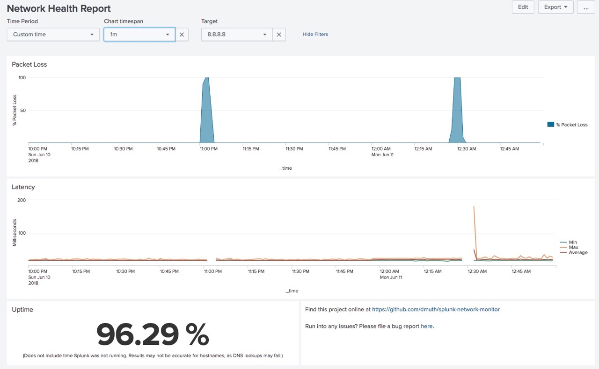

# Splunk Network Health Check

This app will monitor health of your Internet connection by pinging Google 
(and a few other hosts) and creating nice graphs.


## Quickest Installation

`curl -s https://raw.githubusercontent.com/dmuth/splunk-network-monitor/master/go.sh | bash`


## Less Quick Installation

Maybe you don't want to pipe some random script on the Internet into your shell, that's cool.
Here are the Docker commands to run it and view the output:

```
docker run --name splunk -d --rm -p 8000:8000 \
	-v $(pwd)/splunk-network-monitor-data:/opt/splunk/var/lib/splunk/defaultdb \
	dmuth1/splunk-network-monitor
docker logs -f splunk
```


No matter how you install it, you can then go to http://localhost:8000/ and get graphs like these:

 


Data will be persisted in the `splunk-network-monitor-data/` directory between container runs.


### Default Targets

These are the default targets, but can be overridden with `-e TARGETS=...`: 

- google.com
- 8.8.8.8 (Google's DNS Resolver)
- 1.1.1.1 (CloudFlare's DNS Resolver)

I picked Google because it's a fairly well connceted site, and I picked the second two IPs so that if 
DNS is flaky, it won't impact either those, and those two IP addresses are owned by completely different entities.


## More detailed options

- `--restart unless-stopped` - Causes this container to restart if killed Docker is restarted. **This is highly recommended.**
- `-e "TARGETS=google.com cnn.com 8.8.8.8 1.1.1.1"` - Specify hosts to ping
- `-e TZ=EST5EDT` - Specify the timezone of the container (UTC by default)
- `-e SPLUNK_PASSWORD=password` - Set a non-default password. You WILL do this if you run this in a production environment.
- `-e INTERACTIVE=1 -it` - If you want an itneractive shell.


## What's Splunk?

Splunk is an amazing app that lets you monitor your logfiles and perform analytics on them.  You can monitor other kinds of data, such as the output of the ping command, which is what this app does.  A free copy of Splunk Enterprise [can be downloaded at Splunk.com](http://www.splunk.com/) and is downloaded in the Dockerfile.


## How does it work?

At its core, this app uses not one, but **two** scripts to run ping.  The first script (`ping.sh`) pings google.com for 10 seconds at a time and then returns the results.  The second script (`ping-long.sh`) pings google.com for 5 minutes at a time and then returns the results.  

The reason for these two separate scripts is because the first script is useful seeing what short-term behavior of your Internet connection is, but there can be a pause of as much as 1 second between invocations of the script.  `ping-long.sh` mitigates that by running for a much longer interval and can be used to see how your connection performed over a longer period of time.


## Security Concerns

**Please** set a password if you are deploying this on anything other than a personal device.
That is done with `-e SPLUNK_PASSWORD=<password>`.


## Development

Here's how to do development:

```
docker build . -t splunk && \
	docker run --rm --name splunk \
	-e INTERACTIVE=1 -e TZ=EST5EDT -ti -p 8000:8000 \
	-v $(pwd)/splunk-network-monitor-data:/opt/splunk/var/lib/splunk/defaultdb \
	-v $(pwd):/mnt \
	--privileged \
	splunk
docker tag splunk dmuth1/splunk-network-monitor
docker push dmuth1/splunk-network-monitor
```

`--privileged` is specified so that `/opt/splunk/etc/apps/Network-Monitor/bin/icmp_loop.sh` can
be run inside of the container for testing.


## Known Bugs

For reasons unclear to me, if you set up a VPN connection, this completely breaks ping in all
Docker containers.  Even `docker run alpine ping google.com` doesn't work.

The workaround is to simply restart Docker.  If you started your container with `--restart unless-stopped`,
it will start up automatically.  I am unclear on if this is something that can be fixed.


## Questions, comments, abuse, and offers of employment

- Email: doug.muth@gmail.com
- Twitter: http://twitter.com/dmuth
- Facebook: http://facebook.com/dmuth


